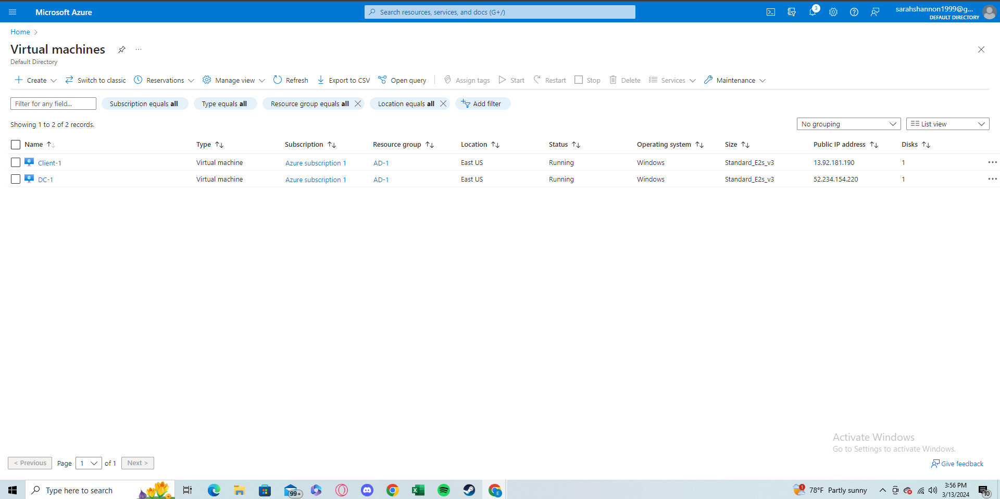
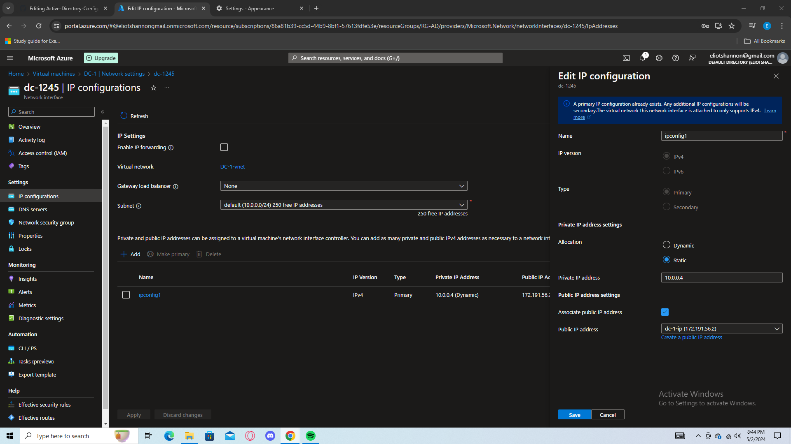
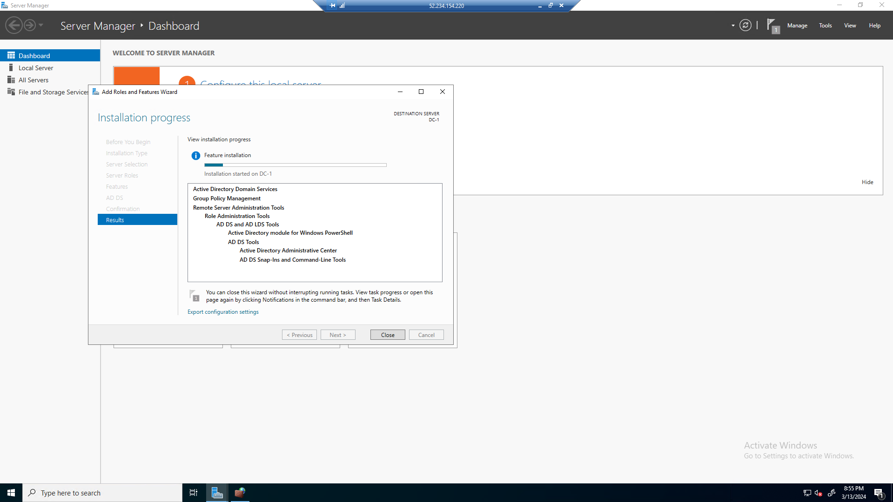
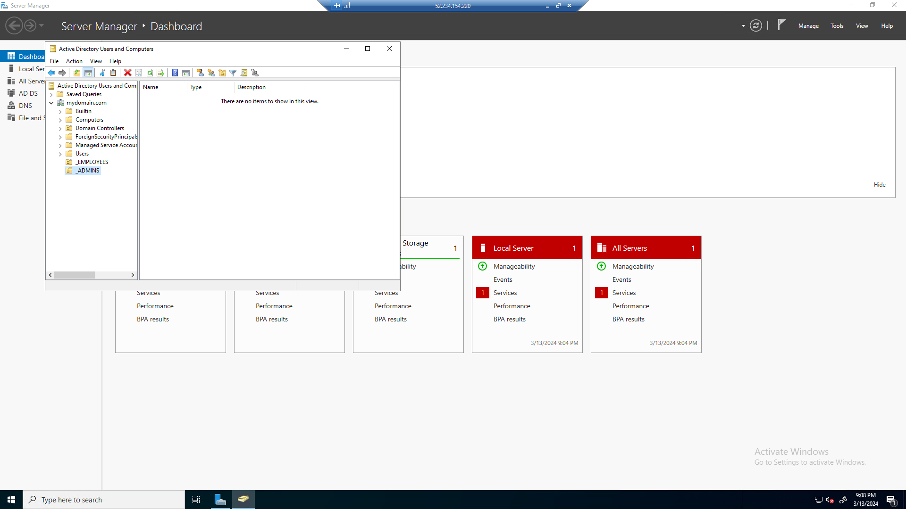
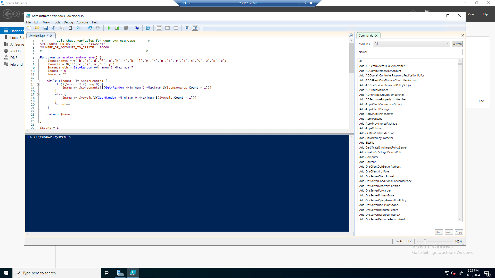
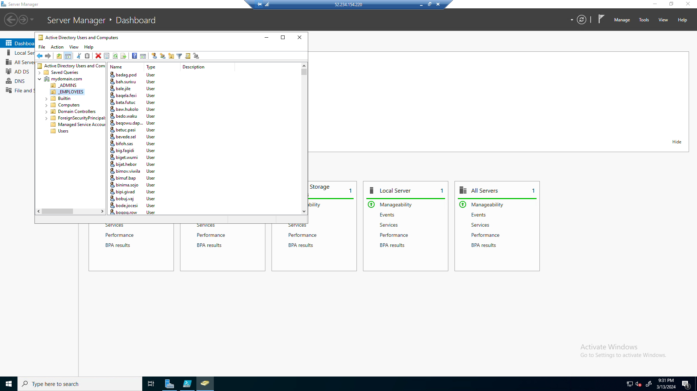

<h1>On-premises Active Directory Deployed in the Cloud (Azure)</h1>
This tutorial outlines the implementation of on-premises Active Directory within Azure Virtual Machines. 

<h2>Environments and Technologies Used</h2>

- Microsoft Azure (Virtual Machines/Compute)
- Remote Desktop
- Active Directory Domain Services
- PowerShell

<h2>Operating Systems Used </h2>

- Windows Server 2022
- Windows 10 (21H2)

<h2>High-Level Deployment and Configuration Steps</h2>

- Creating Azure Resources
- Installing Active Directory
- Joing Client to AD
- Setup Remote Desktop for non-administrative users

<h2>Deployment and Configuration Steps</h2>

<h3>Setting up Azure Resources</h3>

Create two virtual machines, one called DC, and the other called "Client 1". When creating "DC-1" use windows server as the operating system. "Client 1 will be windows 10. Make sure they both are on the same subnet. After creating both, go to your "DC-1" VM and set the Network interface to be static. Do this by cliking on to the VM then going to network settings. Once your there click on the Network Interface then navigate to "IP Configurations", from there set the IP to static.

 

<h3>Ensuring Connectivity</h3>

Login to Client-1 with remote desktop and ping DC-1's private IP address with ping -t (ip address). Login to the domain controller and enable ICMPv4 on the local windows firewall. Check back on client 1 to see if it worked.

 

<h3>Installing Active Directory</h3>

Login to DC-1 and install domain services from the service manager dashboard. Once installed, click the flag with the warning sign on the top right of the server manager. On this page set up a new forrest as "mydomain.com. Once you do this, restart your VM and log back in. 

<h3>Post Installation setup</h3>

  In your DC-1 VM, open up "Active Directory Users and computers". Then Create two organizational Units named _ADMINS and _EMPLOYEES. Once that is done add an "admin" named Jane Doe to "_ADMINS". After adding Jane, access the properties tab by right cliking on the name. Navigate to "member of and add the role "Domain Admins" by typing it. Press apply and Jane is now an Admin.

<h3>Joining "Client-1" to "DC-1"</h3>

  

<h3>Setting up Remote Desktop for Non-Administrative Users</h3>

<h3>Active Directory Activity</h3>

  Open up PowerShell_ise as an administrator, paste the script in a new file and run the script. There should be a bunch of randomly generated accounts. You can use one of these accounts to login on the "Client-1" VM. 

 
